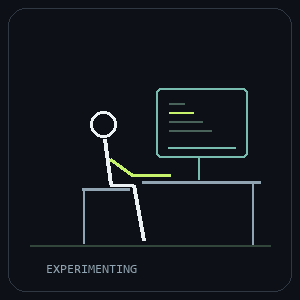

<picture>
  <source media="(prefers-reduced-motion: reduce)" srcset="./assets/profile/curiosity.png">
  
</picture>

<h1 align="center">Hey, I’m Logesh.</h1>

<strong>A curiosity-driven teenager.</strong>

<samp>If something interests me, I go deep. I like challenging myself and seeing how far I can go.</samp>

  <a href="https://github.com/Logesh-vr">GitHub</a> &nbsp; / &nbsp;
  <a href="https://www.linkedin.com/in/logesh-rajaraman-665798323/">LinkedIn</a> &nbsp; / &nbsp;
  <a href="https://leetcode.com/u/Logesh4545/">LeetCode</a> &nbsp; / &nbsp;
  <a href="mailto:logeshrv2006@gmail.com">Say hello</a>

---

### A little about me

<picture>
  <source media="(prefers-reduced-motion: reduce)" srcset="./assets/profile/explore-move.png">
  
</picture>

I’m **Logesh**, a curiosity-driven teenager and a B.Tech Computer Science student. When I find something interesting, I want to go deep and understand it. I’m always ready to challenge myself and my limits.

New things excite me, especially things I haven’t explored yet. That could be a project, a way of moving my body, music, or something completely unrelated to what I’m into right now.

One downside: when a project stops interesting me, I tend to move on. I’m still figuring that part out.

I don’t want to spend these years only being a student. I move my body a lot too—**resistance training, running, and calisthenics** are part of my life.

 

### Some things I’ve built

**01 / [Virtual Fly Lab](https://github.com/Logesh-vr/fuitfly2)** &nbsp; — &nbsp; _Neural signals → movement_

I connected a published fruit-fly spiking brain model to a simulated walking body, using sensory encoding and motor decoding to close the loop. There’s also a second fly with its own brain and physics world. It’s a research prototype, with browser controls and logs to inspect what happens.

Python · Brian2 · MuJoCo · FlyGym

**02 / [VaanThuli](https://github.com/Logesh-vr/VaanThuli)** &nbsp; — &nbsp; _Orbital elements → a sky to explore_

I used SGP4 to calculate satellite positions from orbital data, then put them on a 3D Earth. You can explore the satellites and filter their ground tracks around your location.

Three.js · SGP4 · Fastify

**03 / [EvoTheDino](https://github.com/Logesh-vr/EvoTheDino)** &nbsp; — &nbsp; _Failed runs → better candidate brains_

I built a neural network in JavaScript to choose actions in the Dino runner. Each generation is evaluated, and selection, crossover, and mutation produce the next set of brains. You can watch the network’s activity as it plays.

JavaScript · Neural networks · Genetic algorithms

[More experiments on GitHub ↗](https://github.com/Logesh-vr?tab=repositories)

### My toolkit

| Building interfaces             | Connecting systems         | Exploring intelligence               |
| :------------------------------ | :------------------------- | :----------------------------------- |
| React · TypeScript · JavaScript | Python · FastAPI · Node.js | Neural networks · OpenCV · MediaPipe |
| Flutter · Three.js              | SQL · PostgreSQL · Git     | NumPy · Pandas · Simulation          |

---

<samp>Got something interesting to share? Say hi.</samp>  
<a href="mailto:logeshrv2006@gmail.com">logeshrv2006@gmail.com</a>

