<picture>
  <source media="(prefers-reduced-motion: reduce) and (max-width: 600px)" srcset="./assets/profile/midnight/banner-mobile.png">
  <source media="(prefers-reduced-motion: reduce)" srcset="./assets/profile/midnight/banner.png">
  <source media="(max-width: 600px)" srcset="./assets/profile/midnight/banner-mobile.gif">
  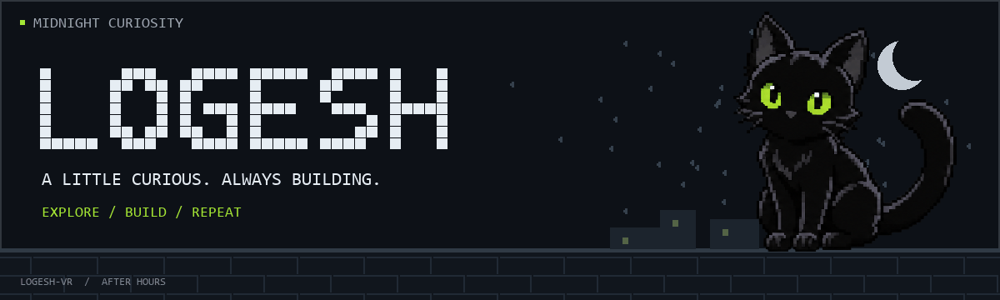
</picture>

<strong>Curiosity-driven builder · B.Tech Computer Science</strong> 
<samp>If something interests me, I go deep.</samp>

<h3>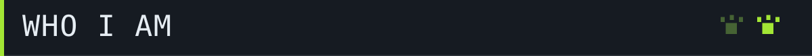</h3>

I’m **Logesh**, a curiosity-driven teenager and a B.Tech Computer Science student. When I find something interesting, I want to go deep and understand it. I’m always ready to challenge myself and my limits.

<h3>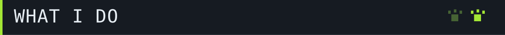</h3>

I build software and explore AI, neural networks, and simulations. I like connecting things: neural signals to a walking body, orbital data to a sky you can explore, and failed runs to better candidate brains.

One downside: when a project stops interesting me, I tend to move on. I’m still figuring that part out.

<h3>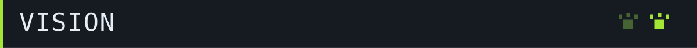</h3>

I like challenging myself and seeing how far I can go. New things excite me, especially things I haven’t explored yet. I want to understand what I’m building, and keep getting better along the way.

<h3>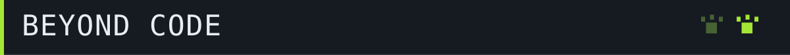</h3>

I don’t want to spend these years only being a student. **Resistance training, running, and calisthenics** are part of my life. So are music and exploring things completely unrelated to what I’m into right now.

<h3>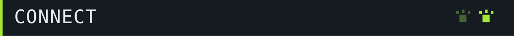</h3>

<table width="100%">
  <tr>
    <td align="center" width="33%"><a href="https://github.com/Logesh-vr"> GitHub</a></td>
    <td align="center" width="34%"><a href="https://www.linkedin.com/in/logesh-rajaraman-665798323/"> LinkedIn</a></td>
    <td align="center" width="33%"><a href="https://leetcode.com/u/Logesh4545/"> LeetCode</a></td>
  </tr>
  <tr>
    <td align="center"><a href="https://logeshvr.vercel.app/"> Portfolio</a></td>
    <td align="center"></td>
    <td align="center"><a href="mailto:logeshrv2006@gmail.com"> Email</a></td>
  </tr>
</table>

<h3>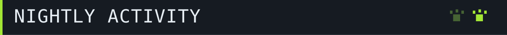</h3>

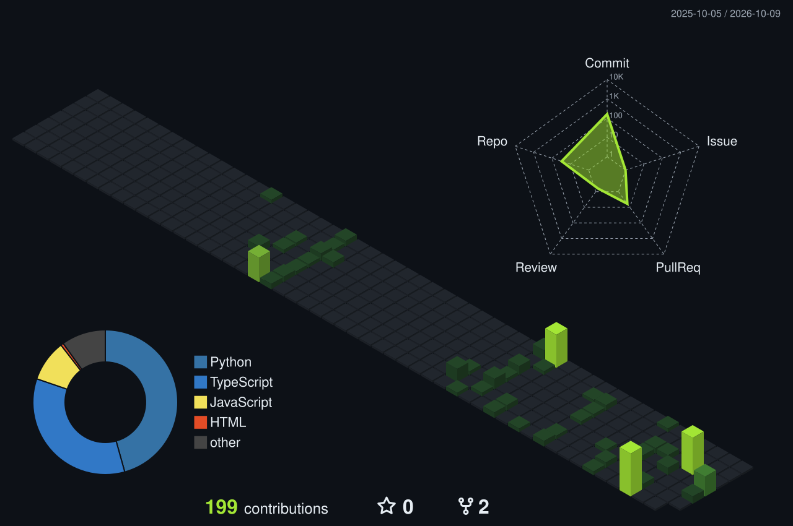

Last-year contributions · public repository stars and forks · refreshes daily

<h3></h3>

**01 / [Virtual Fly Lab](https://github.com/Logesh-vr/fuitfly2)** &nbsp; — &nbsp; _Neural signals → movement_

I connected a published fruit-fly spiking brain model to a simulated walking body, using sensory encoding and motor decoding to close the loop. There’s also a second fly with its own brain and physics world. It’s a research prototype, with browser controls and logs to inspect what happens.

Python · Brian2 · MuJoCo · FlyGym

---

**02 / [VaanThuli](https://github.com/Logesh-vr/VaanThuli)** &nbsp; — &nbsp; _Orbital elements → a sky to explore_

I used SGP4 to calculate satellite positions from orbital data, then put them on a 3D Earth. You can explore the satellites and filter their ground tracks around your location.

Three.js · SGP4 · Fastify

---

**03 / [EvoTheDino](https://github.com/Logesh-vr/EvoTheDino)** &nbsp; — &nbsp; _Failed runs → better candidate brains_

I built a neural network in JavaScript to choose actions in the Dino runner. Each generation is evaluated, and selection, crossover, and mutation produce the next set of brains. You can watch the network’s activity as it plays.

JavaScript · Neural networks · Genetic algorithms

[More experiments on GitHub ↗](https://github.com/Logesh-vr?tab=repositories)

<h3>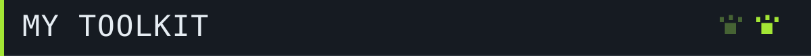</h3>

#### Building interfaces

<table width="100%">
  <tr>
    <td align="center" width="33%"> React</td>
    <td align="center" width="34%"> TypeScript</td>
    <td align="center" width="33%"> JavaScript</td>
  </tr>
  <tr>
    <td align="center"> Flutter</td>
    <td align="center"> Three.js</td>
    <td align="center"></td>
  </tr>
</table>

#### Connecting systems

<table width="100%">
  <tr>
    <td align="center" width="33%">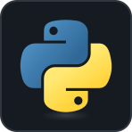 Python</td>
    <td align="center" width="34%"> FastAPI</td>
    <td align="center" width="33%">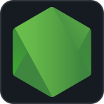 Node.js</td>
  </tr>
  <tr>
    <td align="center">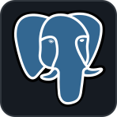 PostgreSQL</td>
    <td align="center">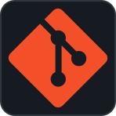 Git</td>
    <td align="center"></td>
  </tr>
</table>

Also: SQL

#### Exploring intelligence

<table width="100%">
  <tr>
    <td align="center" width="33%"> OpenCV</td>
    <td align="center" width="34%">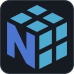 NumPy</td>
    <td align="center" width="33%">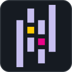 Pandas</td>
  </tr>
  <tr>
    <td align="center"> Simulation</td>
    <td align="center"></td>
    <td align="center">Neural networks MediaPipe</td>
  </tr>
</table>

Also: neural networks · MediaPipe

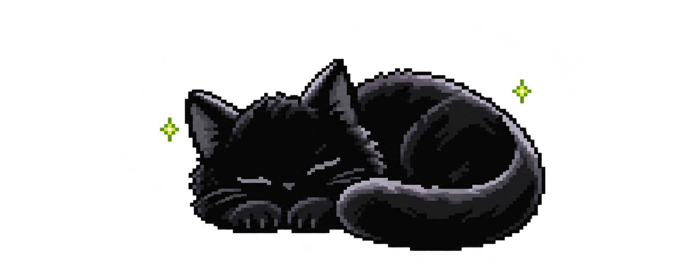

<samp>Got something interesting to share? Say hi.</samp>  
<a href="mailto:logeshrv2006@gmail.com">logeshrv2006@gmail.com</a>

