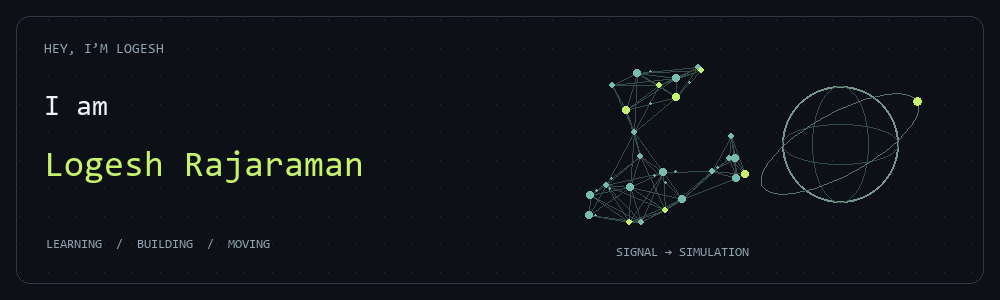

<picture>
  <source media="(prefers-reduced-motion: reduce)" srcset="./assets/profile/curiosity.png">
  
</picture>

<h1 align="center">Hey, I’m Logesh.</h1>

<strong>Computer science student · Full-stack builder · AI & simulation explorer</strong>

<samp>I like finding out how things work. Then making them do something interesting.</samp>

  <a href="https://github.com/Logesh-vr">GitHub</a> &nbsp; / &nbsp;
  <a href="https://www.linkedin.com/in/logesh-rajaraman-665798323/">LinkedIn</a> &nbsp; / &nbsp;
  <a href="mailto:logeshrv2006@gmail.com">Say hello</a>

---

### A little about me

I’m **Logesh Rajaraman**, a B.Tech Computer Science student who likes building across disciplines—from web applications and data pipelines to neural networks and simulated worlds.

The projects that pull me in usually have a question at their centre: **Can neural spikes drive a body? What does an orbit look like from here? Can a dinosaur evolve its own decisions?** I enjoy turning those questions into software I can inspect, experiment with, and improve.

My focus is on understanding the mechanism, connecting the pieces, and making the result approachable. Away from the keyboard, I’m into fitness. The same rule applies to both: **be better than yesterday.**

### Three worlds I’ve been building

**01 / [Virtual Fly Lab](https://github.com/Logesh-vr/fuitfly2)** &nbsp; — &nbsp; _Neural signals → movement_

A published fruit-fly spiking brain model meets a simulated walking body. Sensory encoding and motor decoding close the loop; a second independent brain and physics world take the experiment one level deeper. Built as an inspectable research prototype with browser controls and activity logs.

Python · Brian2 · MuJoCo · FlyGym

**02 / [VaanThuli](https://github.com/Logesh-vr/VaanThuli)** &nbsp; — &nbsp; _Orbital elements → a sky to explore_

Satellite positions calculated with SGP4, rendered on a 3D Earth, and filtered around an observer’s location. A meeting point for real data, applied mathematics, and visual engineering.

Three.js · SGP4 · Fastify

**03 / [EvoTheDino](https://github.com/Logesh-vr/EvoTheDino)** &nbsp; — &nbsp; _Failed runs → better candidate brains_

A JavaScript neural network senses obstacles and chooses actions in the Dino runner. Selection, crossover, and mutation breed the next generation—an experiment in AI fundamentals you can watch unfold.

JavaScript · Neural networks · Genetic algorithms

[More experiments on GitHub ↗](https://github.com/Logesh-vr?tab=repositories)

### My toolkit

| Building interfaces             | Connecting systems         | Exploring intelligence               |
| :------------------------------ | :------------------------- | :----------------------------------- |
| React · TypeScript · JavaScript | Python · FastAPI · Node.js | Neural networks · OpenCV · MediaPipe |
| Flutter · Three.js              | SQL · PostgreSQL · Git     | NumPy · Pandas · Simulation          |

Tools from my projects—not a checklist of everything I’ve mastered.

---

<samp>Interesting question? Let’s build something around it.</samp>  
<a href="mailto:logeshrv2006@gmail.com">logeshrv2006@gmail.com</a>

