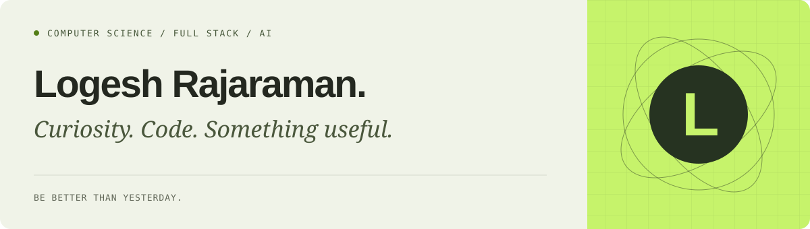

### Hi, I’m Logesh.

I’m a **B.Tech Computer Science student** exploring full-stack development, AI, and hardware. I like turning interesting problems into working software—and learning something new along the way.

[GitHub](https://github.com/Logesh-vr) · [LinkedIn](https://www.linkedin.com/in/logesh-rajaraman-665798323/) · [Email](mailto:logeshrv2006@gmail.com)

### Selected work

| Project                                                      | How it works                                                                                                                                                                                            | Technologies                                      |
| :----------------------------------------------------------- | :------------------------------------------------------------------------------------------------------------------------------------------------------------------------------------------------------ | :------------------------------------------------ |
| **[Virtual Fly Lab](https://github.com/Logesh-vr/fuitfly2)** | Couples a published fruit-fly spiking brain model to body physics through sensory encoding and motor decoding; adds a second independent brain and world with inspectable activity and experiment logs. | Python · Brian2 · MuJoCo                          |
| **[VaanThuli](https://github.com/Logesh-vr/VaanThuli)**      | Turns satellite orbital elements into positions with SGP4, renders them on a 3D Earth, and filters ground tracks around a location-based sky bubble.                                                    | Three.js · SGP4 · Fastify                         |
| **[EvoTheDino](https://github.com/Logesh-vr/EvoTheDino)**    | Evolves neural-network brains for the Chromium Dino runner: sense obstacles, evaluate runs, preserve champions, and breed the next generation through crossover and mutation.                           | JavaScript · Neural networks · Genetic algorithms |

[Explore more repositories →](https://github.com/Logesh-vr?tab=repositories)

### Tools I work with

- **Applications:** React, TypeScript, JavaScript, Node.js, Flutter
- **APIs & data:** Python, FastAPI, SQL, PostgreSQL
- **AI & exploration:** OpenCV, MediaPipe, NumPy, Pandas
- **Foundations:** C, C++, Git

### Beyond the keyboard

Fitness is a big part of my life. Whether I’m training, debugging, or exploring a new idea, I value curiosity and consistency.

**Be better than yesterday.**

---

Have an interesting problem or want to build something together? **[Say hello.](mailto:logeshrv2006@gmail.com)**
